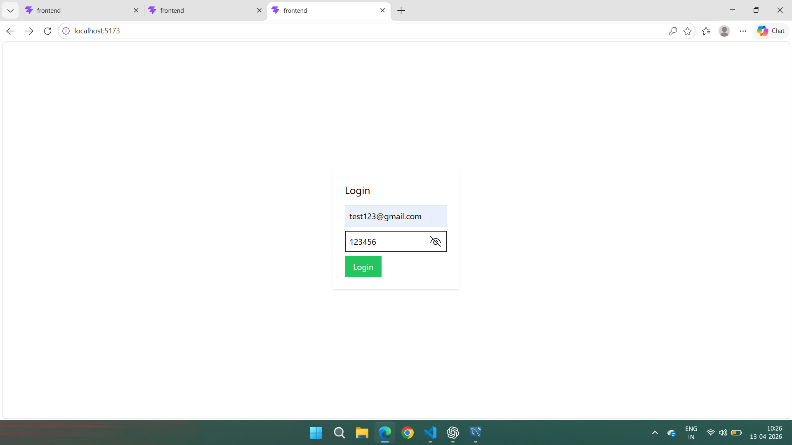
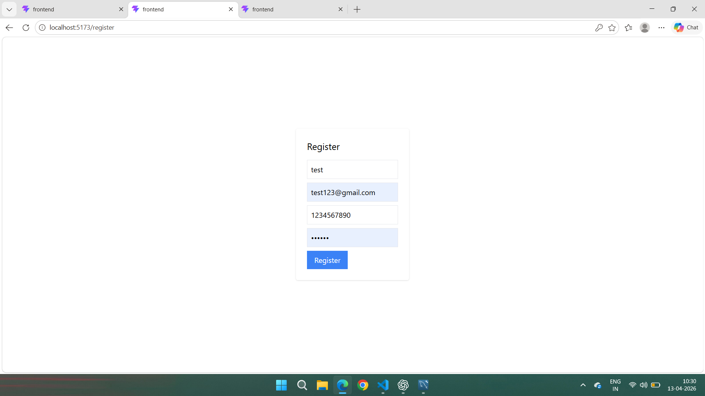
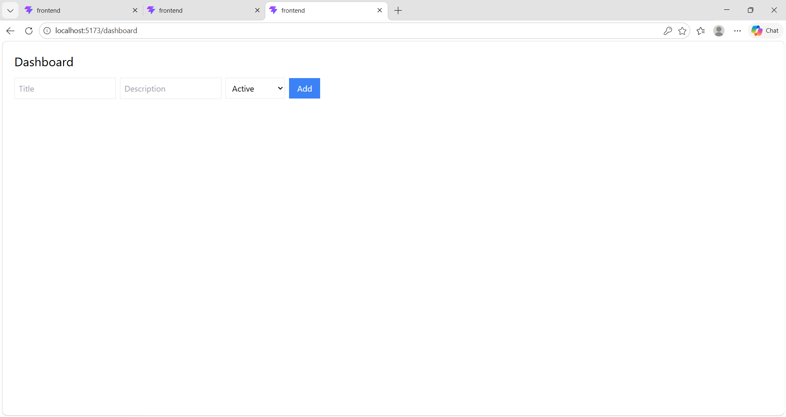
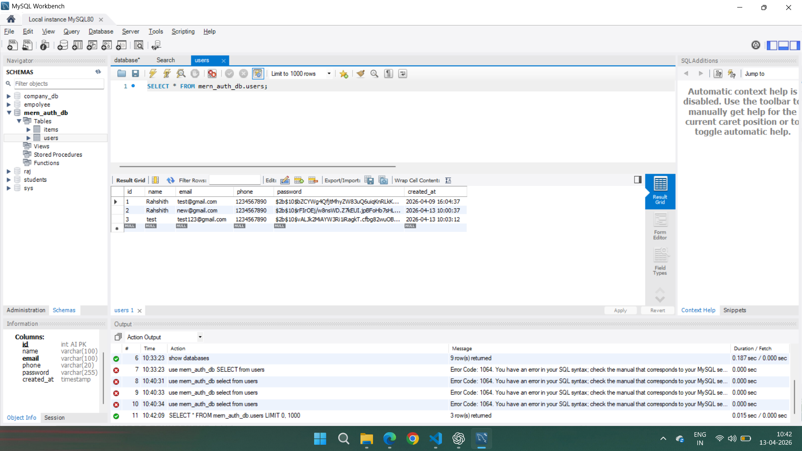
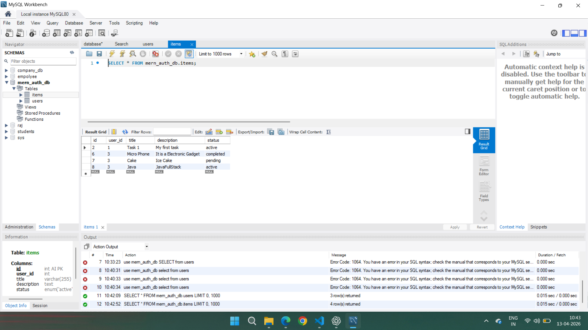
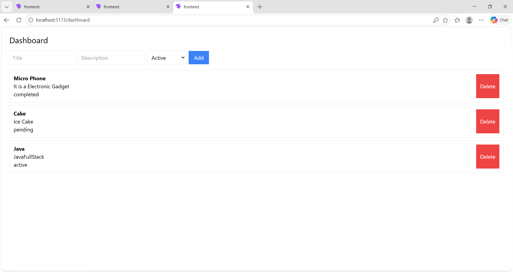

# MERN Stack Authentication & CRUD with MySQL

## 📌 Project Description
This is a full-stack web application built using React, Node.js, Express, and MySQL. It includes user authentication and a dashboard with CRUD operations.

## 🛠️ Tech Stack
- Frontend: React.js, Tailwind CSS
- Backend: Node.js, Express.js
- Database: MySQL
- Authentication: JWT

## ⚙️ Backend Setup

1. Go to backend folder:
   cd backend

2. Install dependencies:
   npm install

3. Create .env file:
   PORT=5000
   DB_HOST=localhost
   DB_USER=root
   DB_PASSWORD=your_password
   DB_NAME=mern_auth_db
   JWT_SECRET=mysecretkey

4. Start server:
   npx nodemon server.js

---

## 🎨 Frontend Setup

1. Go to frontend folder:
   cd frontend

2. Install dependencies:
   npm install

3. Start frontend:
   npm run dev

---

## 🔐 Features

- User Registration & Login
- JWT Authentication
- Protected Routes
- CRUD Operations (Create, Read, Update, Delete)
- Dashboard UI

---

## 📡 API Endpoints

### Auth
- POST /api/auth/register
- POST /api/auth/login

### Items
- GET /api/items
- POST /api/items
- PUT /api/items/:id
- DELETE /api/items/:id

---

## 🗄️ Database

- MySQL database: mern_auth_db
- Tables: users, items

---

## 📸 Screenshots

---

## 🚀 How to Run

1. Start MySQL
2. Run backend
3. Run frontend
4. Open http://localhost:5173

---

## 📂 GitHub Repository

(Add your GitHub link here)
